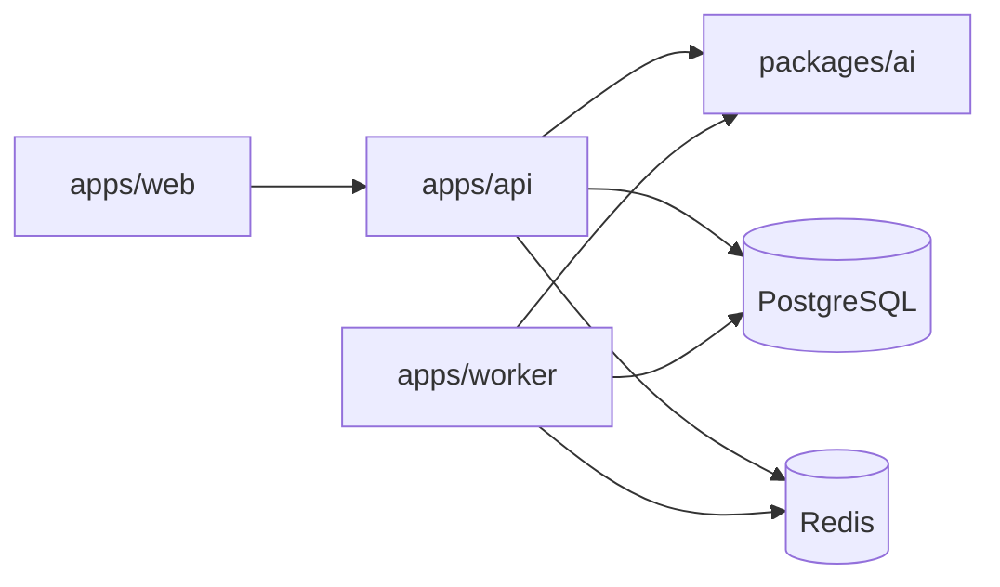

# Creator Architecture

Creator is a mentoring-first AI software engineering platform.

## Runtime

- `apps/web` — Next.js product UI
- `apps/api` — NestJS REST API + Better Auth bridge
- `apps/worker` — BullMQ consumers for codegen/review
- `packages/ai` — OpenRouter model router, agents, pipeline engine
- `packages/database` — Prisma schema + client
- `packages/prompts` — mode/step prompt templates
- `packages/security` — secret/vuln/performance scanners

## Generation rule

No application source files are generated until `approvedForCode === true` at the `await_approval` stage.

## Diagram

